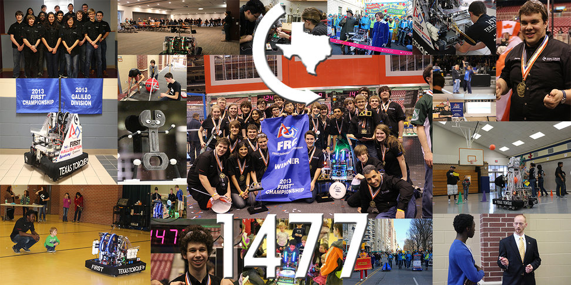

import { Image } from "astro:assets";
import heroImage from "../../assets/eboard.png";

We are frsinθ

FIRST Robotics Teams 1477 and 7492, Texas and Turbo Torque, are high school robotics teams out of The Woodlands, TX dedicated to giving our members hands-on experiences in science, technology, engineering, and mathematics (STEM).

TorqueTeach is an open-source library of information designed to educate those interested in diving deeper into FRC. With a collection of tutorials spanning multiple subteams, TorqueTeach is the perfect place to go to start learning more about the process of anything related to robotics, whether it is programming your robot or learning how to design a professional part for 3D printing or machining. TorqueTeach features in-depth instruction on the process behind the topic, allowing you to pick up the skills necessary to build your own workflow and bring your ideas to life.

## Subteams

Here is a small overview of the tasks of each subteam and what this guide will teach you to do in each subteam.

#### Programming

The programming subteam codes the robot in C++.

#### Electrical

  <Image
    src={heroImage}
    alt="Electrical Board"
    fill
    sizes="300px"
    style={{ objectFit: "contain" }}
  />

In the electrical subteam, members wire the robot and manage the electrical components. They work closely with the mechanical subteam to make components and wiring pathways accessible and with the programming subteam to integrate sensors and motors to bring the robot to life. The guide is meant to take members from the basic components to advanced CAN and power optimizations.

#### Mechanical

The mechanical subteam has various responsibilities including desiging the robot, machining parts, and assembling subsystems.

#### Business

Business members focus on planning outreach events, promoting the team through social media, and draft award submissions.

## Strategy

Another key elements members must be knowledgeable of is strategy. This is a vital part of FRC competitions.

#### Scouting

Scouters record data about other robots at competitions to make informed decisions during alliance selection and match strategies. This guide will focus on training socuters on using TorqueScout, a custom scouting app, and teach good scouting practices.

#### Analysis

The scouting data must be analyzed effectively to create otpimal alliance selection picks and effective match strategies. In this section, members will learn how to effectively use data to make pick lists and plan match strategies.
